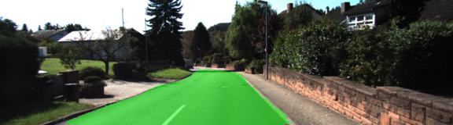
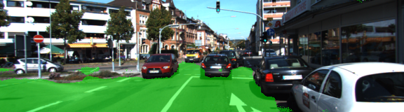
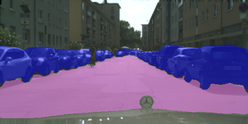

## Semantic Segmentation for Self Driving Car 
>Advanced Deep Learning project

### Goal of the Project:

Labeling pixels of a road in images using a FCN using Semantic Segmentation approach based on VGG Model.

To construct a fully convolutional neural network based on the VGG-16 Image Classifier architecture for performing semantic segmentation to identify drivable road area using the KITTI dataset.

### Implementation:

**Architecture**

The architecture used to build the FCN is known as FCN-8. FCNs are known to work really well on segmentation tasks.
A pre-trained VGG-16 network was converted to a FCN by changing the final FC layer to a 1x1 convolution with depth equal to the number of desired classes.(We have twop classes: Roads and Non-Roads)
Performing 1x1 convolutions on VGG Layers 3 and 4, and adding them element-wise to the initially upsampled transposed convolution lower-level layers (initially 1x1-convolved layer 7 is upsampled before getting added to the 1x1-convolved layer 4). We are using Kernel Intializers and Regularizers for each convolution and transpose convolution layer.

**Hyper parameters**
- Learning rate = 0.0001
- Batch size = 8
- Epochs = 20
- Dropout = 0.5
- Initializer standard deviation = 0.01

**Optimizer**

The loss function for the network is cross-entropy, and an Adam optimizer is used.

**Results**

Loss per batch tends to average below 0.200 after two epochs and below 0.100 after ten epochs. Average loss per batch at epoch 20: 0.048, at epoch 30: 0.074, at epoch 40: 0.036, and at epoch 50: 0.030.

### Usage
**Environment Setup**

 - [Python 3](https://www.python.org/)
 - [TensorFlow](https://www.tensorflow.org/)
 - [NumPy](http://www.numpy.org/)
 - [SciPy](https://www.scipy.org/)
 
 Alternatively you can run:
 
`pip install requirement.txt`

**Downloads**

Download the [Kitti Road dataset](http://www.cvlibs.net/datasets/kitti/eval_road.php) from [here](http://www.cvlibs.net/download.php?file=data_road.zip).  Extract the dataset in the `data` folder.  This will create the folder `data_road` with all the training a test images.

Download the [CityScapes dataset](https://www.cityscapes-dataset.com/)

### Output

**KITTI Dataset**

**CityScape Dataset**

